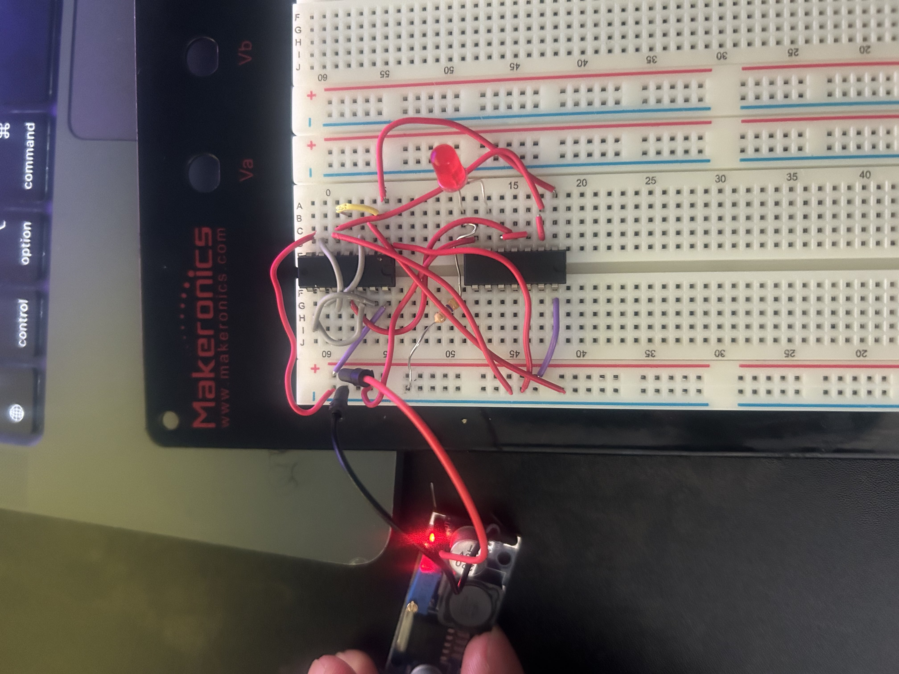
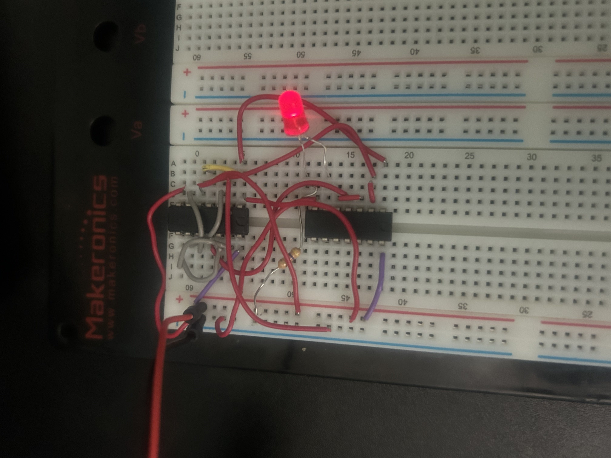
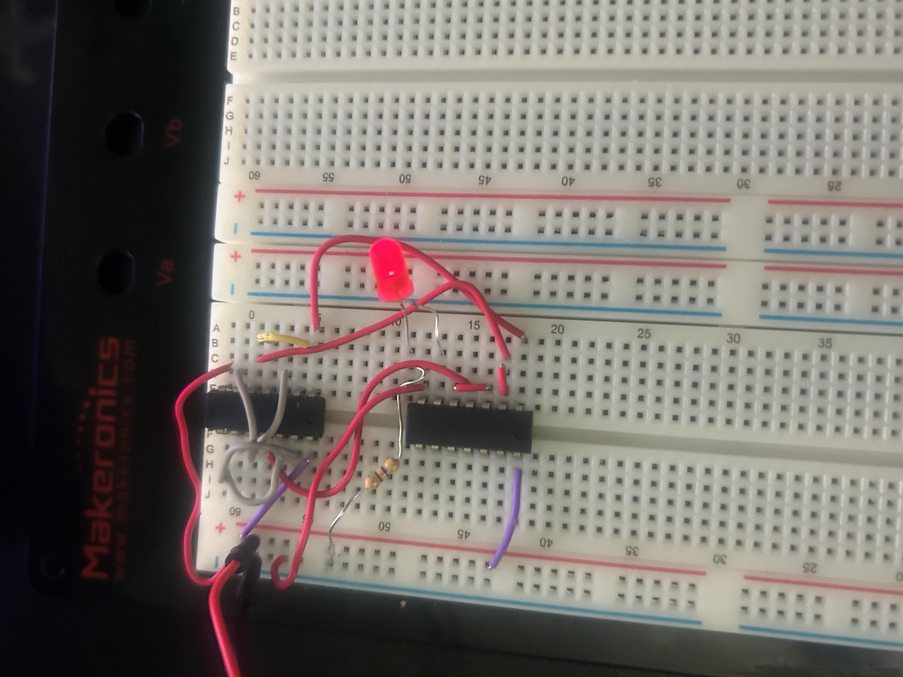

# Lab 2 - NAND Majority Circuit

## Overview

Built and tested a three-input combinational logic circuit using two
SN74LS00N quad 2-input NAND gate ICs on a breadboard.

The circuit implements a three-input majority function. The output is
HIGH when at least two of the three inputs are HIGH.

## Hardware

- 2x SN74LS00N quad 2-input NAND gate ICs
- Breadboard
- LED
- 470 ohm resistor
- Jumper wires
- 5 V power supply

## Boolean Function

The simplified Boolean function for the circuit is:

**M = AB + AC + BC**

This produces a HIGH output whenever two or more of the inputs are HIGH.

## Truth Table

| A | B | C | M |
|---|---|---|---|
| 0 | 0 | 0 | 0 |
| 0 | 0 | 1 | 0 |
| 0 | 1 | 0 | 0 |
| 0 | 1 | 1 | 1 |
| 1 | 0 | 0 | 0 |
| 1 | 0 | 1 | 1 |
| 1 | 1 | 0 | 1 |
| 1 | 1 | 1 | 1 |

## Hardware Implementation

The Boolean circuit was implemented using only 2-input NAND gates.
Two SN74LS00N ICs were used to provide the required NAND gates.

The circuit was powered with a 5 V supply, and an LED was connected
to the final output to indicate the logic state.

- LED OFF = M = 0
- LED ON = M = 1

## Hardware Testing

The physical circuit was tested by applying HIGH (5 V) and LOW (GND)
logic levels to inputs A, B, and C and comparing the resulting output
with the expected truth table.

### Test 1 - A = 0, B = 0, C = 0

**Expected Output:** M = 0  
**Measured Output:** M = 0 (LED OFF)

### Test 2 - A = 1, B = 0, C = 1

**Expected Output:** M = 1  
**Measured Output:** M = 1 (LED ON)

### Test 3 - A = 1, B = 1, C = 1

**Expected Output:** M = 1  
**Measured Output:** M = 1 (LED ON)

## Skills Demonstrated

- Digital logic design
- Breadboard prototyping
- 74LS-series integrated circuits
- NAND gate implementation
- Boolean algebra
- Combinational circuit design
- Truth table verification
- Hardware testing and debugging

## Key Takeaway

This lab provided hands-on experience translating a Boolean logic
design into a physical digital circuit and verifying its operation
against the expected truth table.
