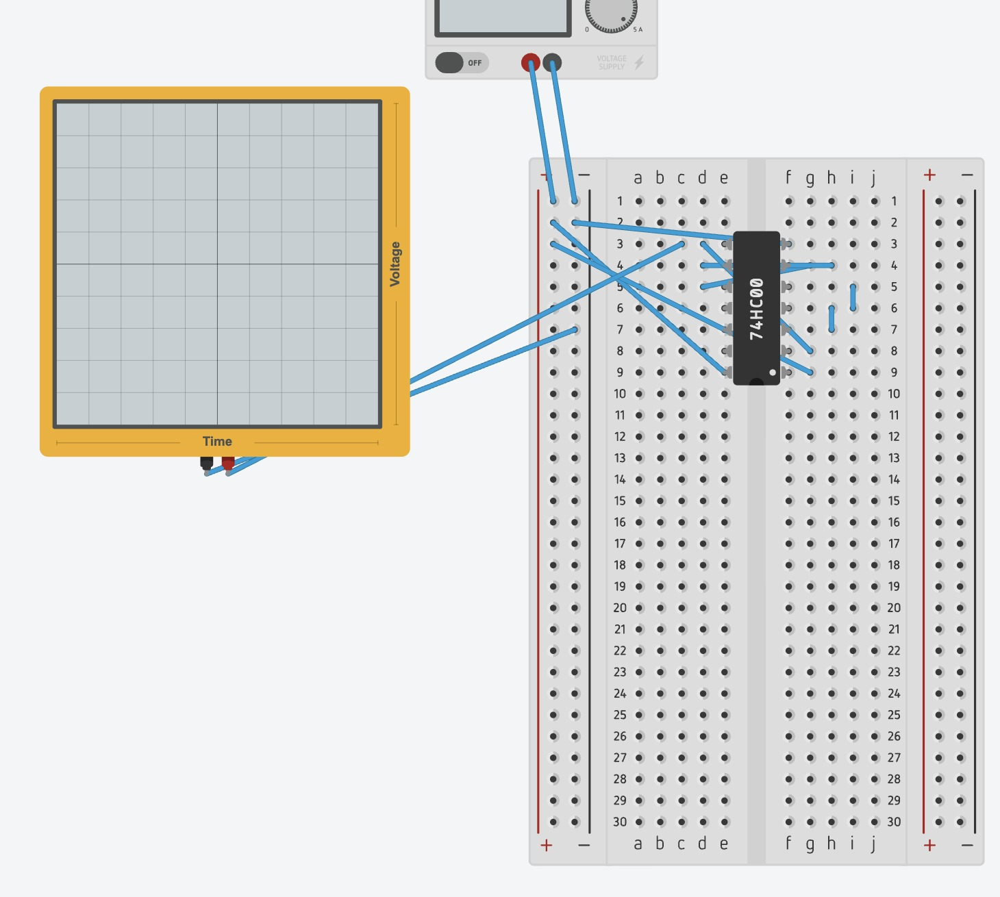
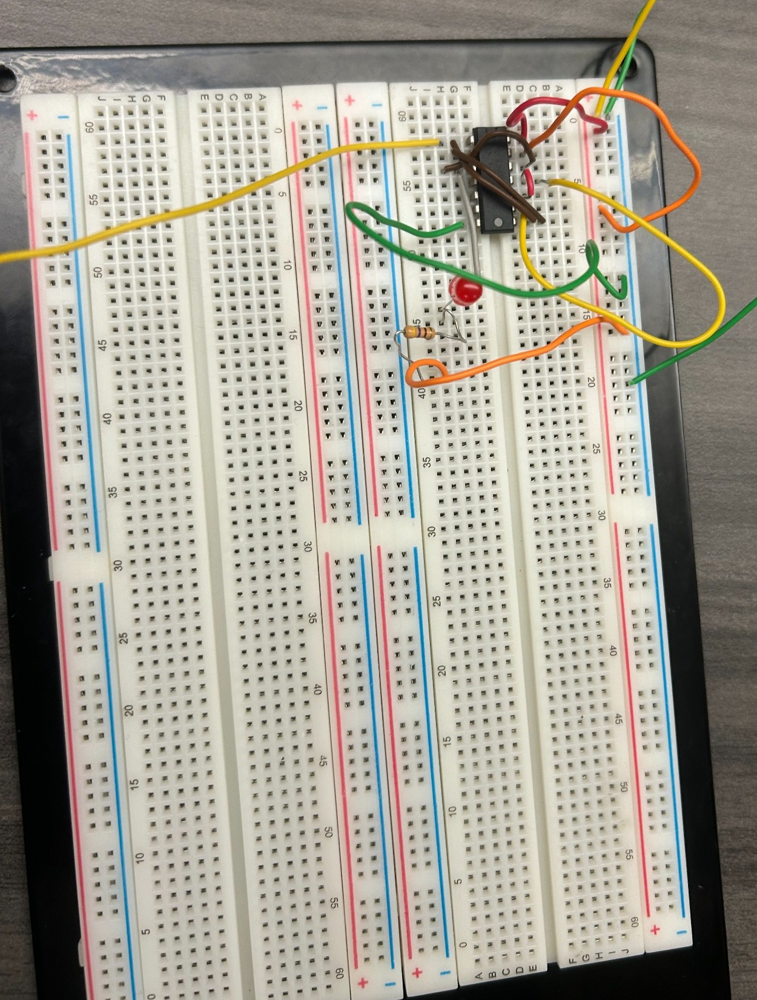
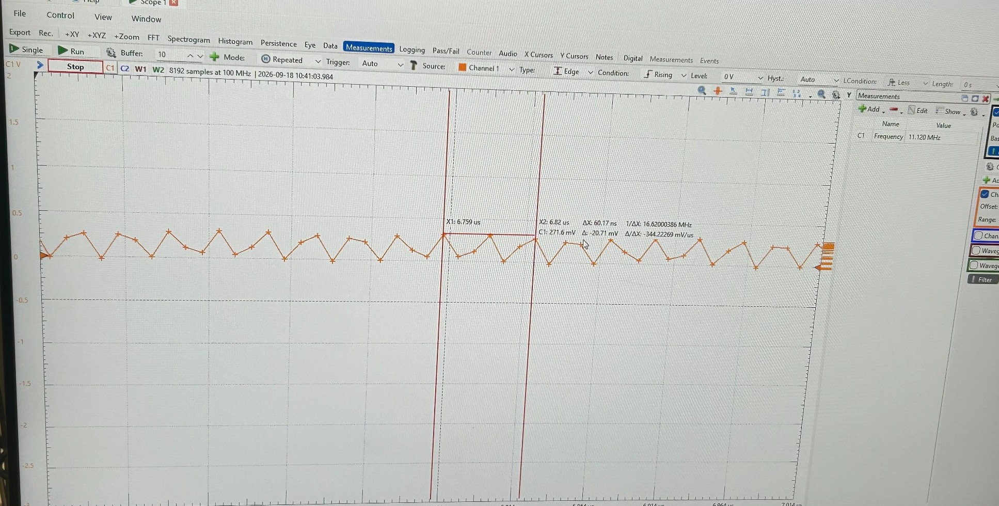

# Lab 3 – NAND-Gate Ring Oscillator

## Overview

Designed and constructed a three-stage NAND-gate ring oscillator using a 74LS00 Quad 2-Input NAND IC. The circuit was implemented on a breadboard and tested using the Digilent Analog Discovery 2 oscilloscope and WaveForms software.

The objective of this lab was to investigate propagation delay, oscillation frequency, and digital signal behavior through physical circuit implementation and oscilloscope measurements.

## Hardware and Software

- 74LS00 Quad 2-Input NAND IC
- Breadboard and jumper wires
- 5V DC power supply
- Digilent Analog Discovery 2
- WaveForms oscilloscope software
- Tinkercad Circuits
- LED and current-limiting resistor

## Circuit Design

A ring oscillator consists of an odd number of inverting logic stages connected in a feedback loop.

Three NAND gates were configured to form the oscillator, with an enable input used to control oscillation.

The propagation delay through each gate causes the output to alternate between HIGH and LOW, producing a periodic signal.

### Tinkercad Wiring Reference

The breadboard wiring was modeled in Tinkercad using a 74HC00 NAND-gate IC as a wiring reference before physical implementation.

### Physical Breadboard Implementation

The oscillator circuit was constructed on a breadboard using a 74LS00 IC and tested with the Digilent Analog Discovery 2.

## Oscilloscope Measurements

The oscillator output was captured and analyzed using the WaveForms oscilloscope software.

The oscilloscope was used to observe the output waveform, measure the oscillation frequency, and investigate signal timing.

### Captured Waveform

### Recorded Measurement

| Measurement | Value |
|---|---|
| Oscilloscope measured frequency | 11.120 MHz |

## Results and Discussion

The experiment demonstrated the construction of a three-stage NAND-gate ring oscillator and the use of an oscilloscope to observe digital signal behavior.

The captured waveform showed repetitive oscillations, demonstrating the effect of propagation delay in a digital feedback circuit.

The oscilloscope reported an oscillation frequency of 11.120 MHz.

The experiment provided practical experience with digital circuit construction, signal measurement, and hardware debugging.

## Skills Demonstrated

- Digital logic circuit design
- NAND-gate implementation
- Breadboard prototyping and IC wiring
- Propagation delay analysis
- Oscilloscope operation and waveform capture
- Frequency and period measurement techniques
- Hardware testing and debugging
