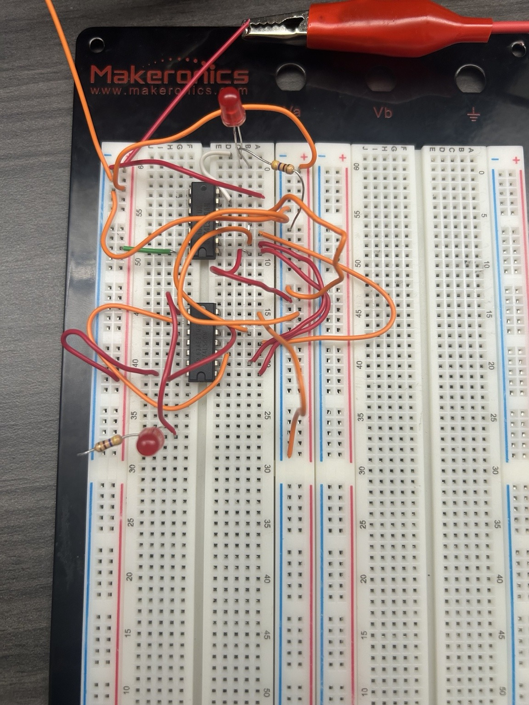
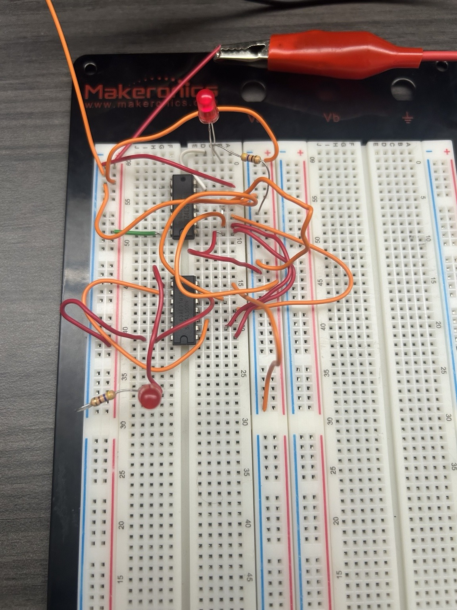
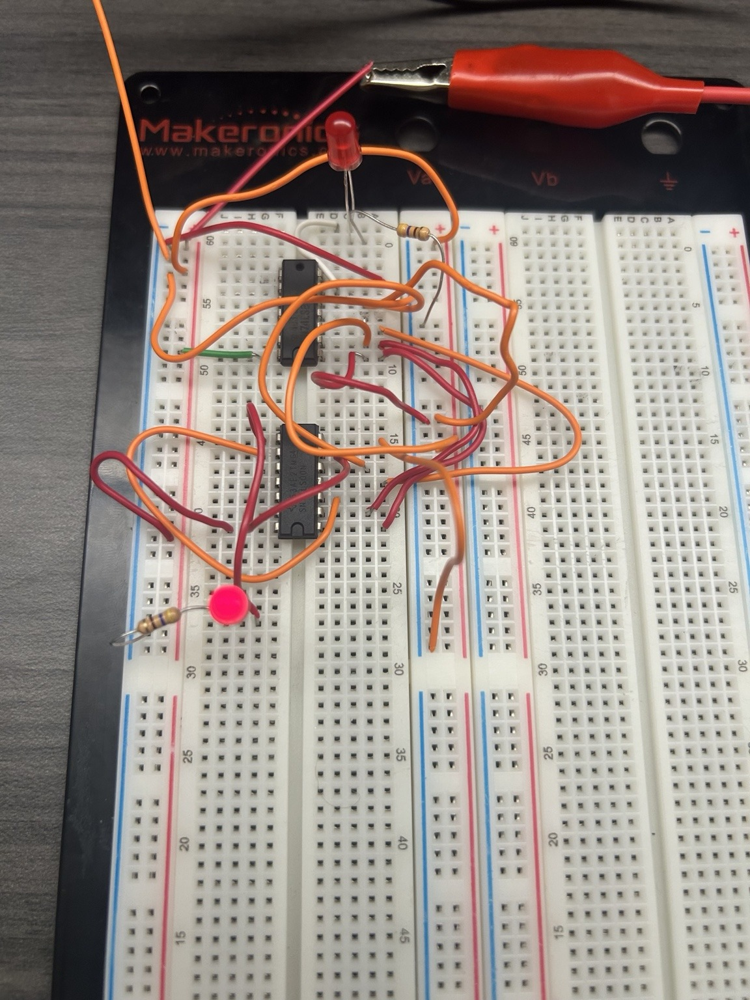
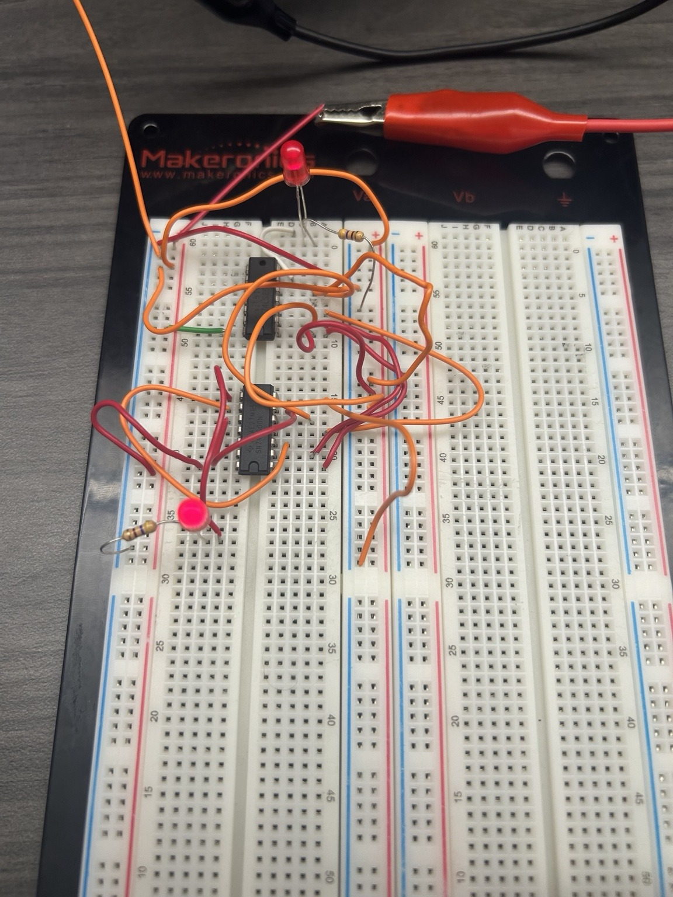
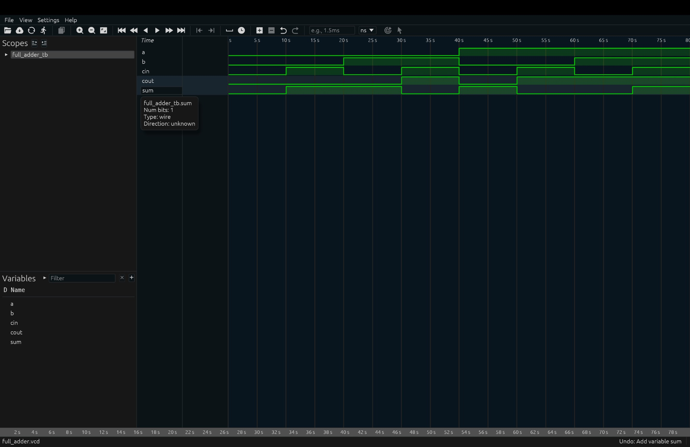

# Lab 4 - Full Adder and Verilog HDL

## Overview

This lab focused on designing, building, and verifying a 1-bit full adder using both physical hardware and Verilog HDL.

The full adder has three inputs:

- `A`
- `B`
- `Cin`

and two outputs:

- `Sum`
- `Cout`

The full adder was first analyzed using a truth table and Karnaugh maps. The optimized circuit was then constructed on a breadboard using XOR and NAND gates. The same circuit was modeled using structural Verilog and verified with a testbench and waveform simulation.

## Truth Table

| A | B | Cin | Sum | Cout |
|---|---|-----|-----|------|
| 0 | 0 | 0 | 0 | 0 |
| 0 | 0 | 1 | 1 | 0 |
| 0 | 1 | 0 | 1 | 0 |
| 0 | 1 | 1 | 0 | 1 |
| 1 | 0 | 0 | 1 | 0 |
| 1 | 0 | 1 | 0 | 1 |
| 1 | 1 | 0 | 0 | 1 |
| 1 | 1 | 1 | 1 | 1 |

## Boolean Expressions

The MSOP expressions obtained from the truth table and Karnaugh maps were:

`Sum = A'B'Cin + A'BCin' + AB'Cin' + ABCin`

`Cout = AB + ACin + BCin`

The optimized sum expression is:

`Sum = A XOR B XOR Cin`

The optimized design uses XOR gates for the `Sum` output and NAND logic for the `Cout` output.

## Physical Hardware Implementation

The full-adder circuit was constructed on a breadboard using XOR and NAND gates. LEDs were connected to the `Sum` and `Cout` outputs to visually verify different input combinations.

### Test Case 1 - A = 0, B = 0, Cin = 0

Expected output:

`Sum = 0`

`Cout = 0`

### Test Case 2 - A = 0, B = 0, Cin = 1

Expected output:

`Sum = 1`

`Cout = 0`

### Test Case 3 - A = 0, B = 1, Cin = 1

Expected output:

`Sum = 0`

`Cout = 1`

### Test Case 4 - A = 1, B = 1, Cin = 1

Expected output:

`Sum = 1`

`Cout = 1`

## Verilog Implementation

The same optimized full-adder circuit was implemented using structural Verilog.

Files included:

- [`full_adder.v`](full_adder.v) - Full-adder module
- [`full_adder_tb.v`](full_adder_tb.v) - Testbench used to exercise all input combinations

The testbench tested all eight possible combinations of `A`, `B`, and `Cin`.

## Simulation Results

The simulation produced the following output:

| Time | A | B | Cin | Sum | Cout |
|------|---|---|-----|-----|------|
| 0  | 0 | 0 | 0 | 0 | 0 |
| 10 | 0 | 0 | 1 | 1 | 0 |
| 20 | 0 | 1 | 0 | 1 | 0 |
| 30 | 0 | 1 | 1 | 0 | 1 |
| 40 | 1 | 0 | 0 | 1 | 0 |
| 50 | 1 | 0 | 1 | 0 | 1 |
| 60 | 1 | 1 | 0 | 0 | 1 |
| 70 | 1 | 1 | 1 | 1 | 1 |

The simulation results matched the expected full-adder truth table.

## Waveform

The simulation waveform was viewed using Surfer.

The waveform shows the transitions of `A`, `B`, and `Cin` and the corresponding changes in `Sum` and `Cout`.

## Hardware and Software

- Breadboard and jumper wires
- XOR logic gate IC
- NAND logic gate IC
- LEDs and current-limiting resistors
- Verilog HDL
- Icarus Verilog
- Surfer waveform viewer
- VS Code

## Results and Discussion

The physical breadboard circuit successfully produced the expected full-adder outputs for the tested input combinations.

The Verilog implementation was also tested using all eight possible input combinations. The console output and Surfer waveform matched the expected truth table.

The experiment demonstrated how the same combinational logic circuit can be implemented using physical logic gates and modeled using a hardware description language.

## Skills Demonstrated

- Combinational logic design
- Full-adder implementation
- Karnaugh-map simplification
- Boolean algebra
- XOR and NAND logic
- Breadboard prototyping and IC wiring
- Structural Verilog
- Testbench development
- Digital waveform analysis
- Hardware and simulation verification
